<div align="center">

# ⚡ Agentic API

**The stateful, agentic API layer for [vLLM](https://github.com/vllm-project/vllm), written in Rust 🦀**

*Run OpenAI-grade agentic workloads (Responses API, server-side tools, Codex) on your own GPUs.*

[](LICENSE)
[](Cargo.toml)
[](https://github.com/vllm-project/agentic-api/actions/workflows/rust.yml)
[](https://github.com/vllm-project/agentic-api/actions/workflows/pre-commit.yml)

</div>

______________________________________________________________________

## 🧠 Overview

vLLM gives you state-of-the-art inference throughput. But real agentic applications need more than raw tokens: they need **conversation state, tool-call loops, and multi-turn orchestration**. Today, all of that complexity lives in your client code.

**Agentic API moves it server-side.** It is a Rust-native gateway that sits in front of vLLM and owns the stateful agentic APIs, starting with an OpenAI-compatible [Responses API](https://platform.openai.com/docs/api-reference/responses). Your application makes *one API call* and the server handles the rest: state hydration, tool execution, streaming, and continuation.

```mermaid
flowchart LR
    C(["🧑‍💻 Client<br/>Codex · SDKs · curl"]) -->|"📮 <code>POST /v1/responses</code><br/>🌐 HTTP&nbsp;&nbsp;📡 SSE&nbsp;&nbsp;🔌 WebSocket"| A
    subgraph A ["⚡ Agentic API (Rust 🦀)"]
        direction TB
        S["🔄 State hydration<br/><code>previous_response_id</code>"]
        T["🛠️ Server-side tools<br/>web search · functions"]
        P["💾 Persistence<br/>SQLite response store"]
    end
    A -->|"🚀 <code>POST /v1/responses</code><br/>⚙️ stateless&nbsp;&nbsp;🤝 OpenAI-compatible"| V(["🚀 vLLM core<br/>inference engine"])

    classDef client fill:#FFE8B3,stroke:#F59E0B,stroke-width:2px,color:#7C2D12
    classDef inner fill:#E0E7FF,stroke:#6366F1,stroke-width:2px,color:#312E81
    classDef engine fill:#DCFCE7,stroke:#22C55E,stroke-width:2px,color:#14532D

    class C client
    class S,T,P inner
    class V engine
    style A fill:#F5F3FF,stroke:#8B5CF6,stroke-width:2px,color:#5B21B6
    linkStyle 0 stroke:#F59E0B,stroke-width:2px
    linkStyle 1 stroke:#22C55E,stroke-width:2px
```



> [!TIP]
> Point [OpenAI Codex](https://github.com/openai/codex) at Agentic API and drive it entirely with open models served by vLLM. No OpenAI account required.

## ✨ Key Features

- 🔄 **Stateful conversations**: the server manages history via `previous_response_id`. No client-side message tracking, no replaying full transcripts.
- 🛠️ **Server-side tool execution**: an explicit tool-ownership model (gateway / client / provider) decides exactly what runs where. Web search ships today via [You.com](https://you.com), and the model executes multi-step tool chains automatically.
- 📡 **Every transport**: non-streaming HTTP, server-sent events for token streaming, and full **WebSocket** support for interactive clients.
- 🧰 **Codex-ready**: accepts Codex-shaped Responses traffic out of the box, preserving the tool declarations and response item shapes Codex depends on.
- 🏃 **Background execution**: fire-and-forget requests that keep processing server-side.
- ✅ **Compatibility tested**: validated against the [Open Responses](https://www.openresponses.org/) compatibility suite, with replay-cassette tests for real OpenAI and vLLM traffic.

## 🧭 API Surface

| Endpoint | Description | Status |
| --- | --- | --- |
| `POST /v1/responses` | OpenAI-compatible Responses API with state, tools, and streaming | ✅ |
| `GET /v1/responses` | WebSocket transport for the Responses API | ✅ |
| `POST /v1/conversations` | Conversation management | ✅ |
| `GET /v1/models` | Model listing proxied from vLLM | ✅ |
| `GET /health` · `GET /ready` | Liveness and readiness probes | ✅ |
| Messages API | Anthropic-style stateful messages on shared primitives | 🚧 Planned |
| Interactions API | Higher-level agentic workflow surface | ⏳ Planned |

## 🚀 Quickstart

**1. Serve a model with vLLM.** Any recipe from [recipes.vllm.ai](https://recipes.vllm.ai) works:

```bash
vllm serve Qwen/Qwen3-30B-A3B-FP8 \
  --tool-call-parser qwen3_coder --enable-auto-tool-choice \
  --reasoning-parser qwen3 --port 5050
```

**2. Start Agentic API**, pointing it at the vLLM server (set the `YOU_*` variables to enable built-in web search):

```bash
YOU_API_KEY=<your-you.com-api-key> YOU_API_BASE_URL=<you.com-api-base-url> \
  cargo run -p agentic-server -- --llm-api-base http://0.0.0.0:5050
```

**3. Make a stateful call:**

```bash
curl http://localhost:9000/v1/responses \
  -H "Content-Type: application/json" \
  -d '{
    "model": "Qwen/Qwen3-30B-A3B-FP8",
    "input": "What is new in vLLM this month?",
    "tools": [{"type": "web_search"}]
  }'
```

Continue the conversation by passing the returned `id` as `previous_response_id`, and the server rehydrates everything for you.

## 🤖 Codex on your own GPUs

Agentic API speaks the Responses wire protocol Codex expects, including WebSockets, so you can run the full Codex experience against open models.

Add a provider to `~/.codex/config.toml`:

```toml
[model_providers.agentic-api]
name = "agentic-api"
base_url = "http://localhost:9000/v1"
wire_api = "responses"
requires_openai_auth = false
supports_websockets = true
```

Then launch Codex:

```bash
codex --disable image_generation -c model_provider=agentic-api -m Qwen/Qwen3-30B-A3B-FP8
```

## 🧩 Tool Ownership Model

Every tool call has exactly one execution path, so nothing runs by accident:

| Ownership | Who executes it | Examples |
| --- | --- | --- |
| **Gateway-owned** | Agentic API executes it server-side and continues the loop | Web search, file search, MCP-backed tools |
| **Client-owned** | Preserved and returned to the client | Codex shell / editor tools, your functions |
| **Provider-owned** | Passed through to vLLM or an upstream provider | Provider-native tools |

Unknown or ambiguous tool shapes are **never executed by default**. They are preserved and returned.

## 🏗️ Repository Layout

```
crates/
├── agentic-server/       # Axum binary, transport handlers (HTTP/SSE/WS), configuration
├── agentic-server-core/  # Protocol types, executor, tool framework, persistence
└── agentic-praxis/       # Praxis gateway integration
docs/                     # MkDocs documentation, ADRs, and design notes
```

## 🛠️ Developing

```bash
cargo build                                  # build
cargo test                                   # test
cargo clippy --all-targets -- -D warnings    # lint
cargo fmt -- --check                         # format check
```

Docs are built with MkDocs:

```bash
uv venv
uv pip install -r docs/requirements.txt
uv run mkdocs serve
```

Design and migration decisions are tracked as ADRs in [docs/adr/](docs/adr/), with deeper design notes in [docs/design/](docs/design/). See the full [ROADMAP](ROADMAP.md) for where the project is heading, and [CONTRIBUTING](CONTRIBUTING.md) to get involved.

## 🗺️ Roadmap at a Glance

- [x] **Responses API hydration**: stateful continuation with `previous_response_id`
- [x] **Codex support**: practical Codex sessions through the Responses API
- [x] **Server-side tool execution**: explicit ownership, web search built in
- [ ] **Messages API**: built on the same persistence and execution primitives
- [ ] **Interactions API**: durable, higher-level agentic workflows
- [ ] **Production hardening**: storage backends, observability, cached-prefix continuation

______________________________________________________________________

## 📄 License

Licensed under the [Apache License 2.0](LICENSE).

<div align="center">

**⭐ If Agentic API saves you from writing one more client-side tool loop, star the repo! ⭐**

</div>
