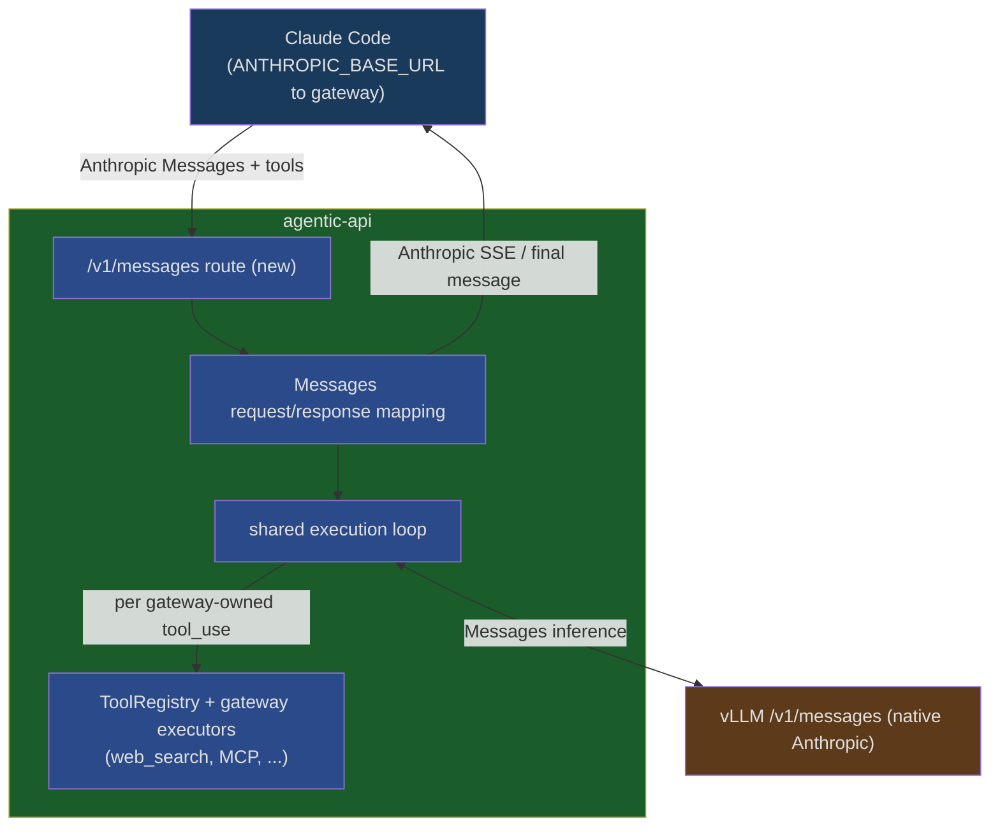

# Design: Claude Code Integration (Anthropic Messages API)

> **References:** [ROADMAP §4 Messages API](../../ROADMAP.md), [Codex CLI Integration](./codex-integration.md), [Tool Framework](./tool-framework.md), [Anthropic LLM Gateway Protocol](https://code.claude.com/docs/en/llm-gateway-protocol) (the authoritative contract for what Claude Code sends a gateway), [Connect Claude Code to a gateway](https://code.claude.com/docs/en/llm-gateway-connect) (dev-side config and the troubleshooting table), [Claude apps gateway](https://code.claude.com/docs/en/claude-apps-gateway) (Anthropic's reference gateway), [vLLM Claude Code integration](https://docs.vllm.ai/en/latest/serving/integrations/claude_code/) (the zero-gateway baseline).
> **Status:** Proposal

---

## Summary

`agentic-api` today serves one stateful inference surface: the OpenAI-compatible Responses API (`/v1/responses`, with its supporting `/v1/conversations` and `/v1/models` routes), including persistence, `previous_response_id` continuation, gateway tool execution, and the multi-turn tool loop built around it. Codex works because Codex also speaks Responses; the only client-specific work was preserving Codex's `namespace` tool shape (see [Codex CLI Integration](./codex-integration.md)).

Claude Code speaks a different protocol — the Anthropic Messages API (`/v1/messages`). Unlike Responses, Messages is **stateless**: Claude Code sends the entire conversation on every turn, so the gateway needs no storage, no persistence, and no rehydration. Supporting Claude Code is therefore not a stateful-surface build like Responses was; it is a **stateless** surface whose only jobs are protocol-faithful proxying and server-side execution of gateway-owned tools.

Concretely, the gateway must implement:

1. **`/v1/messages` and `/v1/messages/count_tokens` routes** that proxy to vLLM — the transparent pass-through floor. **Landed in [#99](https://github.com/vllm-project/agentic-api/pull/99).**
2. **The gateway protocol contract** — forward `anthropic-*` headers and error bodies unchanged, preserve the `system` attribution block, accept either auth header. A naive proxy gets these wrong; see [Gateway protocol contract](#gateway-protocol-contract).
3. **A server-side tool loop** that executes gateway-owned tools (`web_search`, MCP) without ever exposing them to the client, and maps Anthropic `tool_use`/`tool_result` blocks to the shared tool framework. This is the only real value-add, and the only mechanism that works (see [Verification](#what-a-gateway-can-do)).

No storage layer, no `previous_response_id` analog, no stored-response object. The model-facing half is already solved — vLLM implements Messages natively and accepts everything Claude Code sends (see [Verification](#verification)) — so the remaining work is narrower than Responses, and reuses the existing execution core rather than forking it (ROADMAP §4).

---

## Why this differs from Codex

| | Codex | Claude Code |
|---|---|---|
| Wire protocol to the gateway | OpenAI Responses (`/v1/responses`) | Anthropic Messages (`/v1/messages`) |
| Endpoint served today? | Yes | No — must be built |
| vLLM upstream speaks it? | Yes | Yes (verified) |
| Client-specific work | tool `namespace` shape only | a stateful API surface |
| Continuation | `previous_response_id` / `conversation_id` | stateless — the client resends full history each turn |
| Tool-call shape | `function_call` / namespace | `tool_use` / `tool_result` content blocks |

The Codex integration reused an existing endpoint. Claude Code needs a new endpoint that reuses the existing core.

---

## Verification

Testing came in two rounds: Claude Code and curl directly against vLLM (does the upstream speak Messages?), and the real Claude Code CLI through a probe gateway in the path (what can a gateway actually do?). The second round ran against vLLM 0.25.1 (`vllm/vllm-openai:latest`, `Qwen/Qwen3-30B-A3B-FP8`, hermes parser) with the upstream `@anthropic-ai/claude-code` CLI (2.1.208) pointed at a throwaway Python probe sitting between the client and vLLM.

### vLLM speaks Messages

Against vLLM directly, with no gateway in the path:

- `/v1/messages` returns Anthropic-shaped bodies (`{"type":"message","role":"assistant","content":[...],"stop_reason":...,"usage":{...}}`).
- Streaming produces the correct SSE sequence: `message_start` → `content_block_start` → `content_block_delta` (including `thinking_delta`) → `content_block_stop` → `message_delta` → `message_stop`.
- Tool use works: given Anthropic `tools`, the model returns `stop_reason: "tool_use"` and a `tool_use` block.
- The Claude Code CLI drives all of this end to end — a live session completed both a plain turn and a full tool round trip (`tool_use` → local execution → `tool_result` → answer).

vLLM's own [Claude Code doc](https://docs.vllm.ai/en/latest/serving/integrations/claude_code/) confirms this is intended: *"vLLM implements the Anthropic Messages API, which is the same API that Claude Code uses to communicate with Anthropic's servers"* — no proxy or adapter needed. Two setup gotchas from that doc carry into ours: point `ANTHROPIC_DEFAULT_OPUS_MODEL`, `_SONNET_MODEL`, and `_HAIKU_MODEL` all at the one served model (the fix for the [Haiku blocker](#smallfast-haiku-model)), and alias model names via `--served-model-name` because Claude Code rejects names containing `/`.

So chat and client-owned tools already work Claude-Code-to-vLLM with no gateway at all. Anything the gateway adds has to be worth putting itself back in the path.

### What a gateway can do

The probe captured what Claude Code actually sends: `stream: true` always; a 24-tool array of its own client-side tools (`Bash`, `Read`, `Edit`, `WebSearch`, `WebFetch`, `Task*`, …), each with a full `input_schema`; `system` as a list of `{type:text}` blocks (a billing header first, then the agent prompt); and the advanced fields `thinking: {type:"adaptive"}`, `output_config`, `context_management`, `metadata`, `max_tokens`. Credentials arrive in both `Authorization: Bearer` and `x-api-key`. Notably — and contrary to an earlier assumption — Claude Code does *not* disable its built-in `WebSearch` on a gateway session; it ships it as an ordinary client-owned tool.

The load-bearing question was whether a gateway can own tools at all here — whether it can get Claude Code to round-trip a tool the *gateway* executes, the way the Responses side does. Three experiments settled it:

1. Injecting a gateway tool alongside Claude Code's own tools does nothing useful — the model prefers Claude Code's richer native `WebSearch` and the whole loop stays client-side.
2. Forcing the issue — stripping `WebSearch`/`WebFetch` so the gateway tool is the only web option — makes the model call it, and Claude Code answers with `<tool_use_error>Error: No such tool available</tool_use_error>`. This is the key finding: Claude Code executes every `tool_use` against its own local registry and errors on anything it didn't declare. It never waits for the gateway to supply a `tool_result`. Advertising a gateway-owned tool to the client cannot work.
3. Running the loop server-side does work. The gateway injects the gateway-owned tool only into its upstream call to vLLM, executes the model's `tool_use` itself, appends the `tool_result`, loops, and surfaces only the final assistant message — the client never sees the gateway tool. In the spike the tool execution was stubbed (the probe returned a canned string, not a real search), so what this proves is the loop-and-hiding mechanics, not a real `web_search` executor. With that stub in place, a real `claude -p` session asking for a web lookup drove the model to the gateway tool, the gateway executed and looped, and Claude Code rendered the final answer with no client-side error.

The conclusion the rest of this design rests on: the gateway's value-add is real, but reachable only through a server-side loop that keeps gateway-owned tools invisible to the client — the same hide-the-call pattern the Responses path uses (`run_until_gateway_tools_complete`, [tool-framework.md](./tool-framework.md), landed in #83). Wiring a real `GatewayExecutor` into that loop is the first thing Stage 2 must prove.

### Capability pass-through

Every advanced field Claude Code sends is accepted by vLLM 0.25.1 (HTTP 200) — `thinking` (both `adaptive` and `enabled`/`budget_tokens`), `output_config`, `context_management`, `system` as blocks, `metadata` — individually and all together, regardless of the `anthropic-beta` header. There is no field-level `400` hazard on current vLLM; it ignores what it doesn't implement rather than rejecting. The only failure seen in the whole spike was context length — a 500 when Claude Code's ~25k-token system-plus-tools prompt plus `max_tokens: 32000` overran the model's 40960 window, which is a sizing concern, not a protocol one. The "body field and beta header travel together or you get a `400`" hazard is real against Anthropic's hosted API and worth designing for, but it does not bite against vLLM 0.25.1; the gateway should forward `anthropic-*` headers unchanged regardless.

---

## Gateway protocol contract

Per the [Anthropic Gateway Protocol reference](https://code.claude.com/docs/en/llm-gateway-protocol), a gateway behind `ANTHROPIC_BASE_URL` owes the following. These are requirements, not options — and several are exactly where a naive proxy goes wrong.

### Endpoints

- `POST /v1/messages` is required. Inference actually posts to `/v1/messages?beta=true`, so match on the path, not the full URL.
- `POST /v1/messages/count_tokens` is optional; without it Claude Code estimates context locally. Non-goal for the first slice.
- `GET /v1/models` is optional model discovery, off by default (`CLAUDE_CODE_ENABLE_GATEWAY_MODEL_DISCOVERY=1`). Non-goal initially; if added, it needs a 3s timeout, treats any redirect as failure, and returns `data:[{id,display_name}]` with ids starting `claude`/`anthropic`.
- `HEAD /` is a best-effort connectivity probe; the gateway must answer it cleanly rather than 5xx or hang.

### Headers

Forward `anthropic-version` (currently `2023-06-01`) and `anthropic-beta` to vLLM unchanged. Do not allowlist beta values — the set changes per release, so treat it as open.

The gateway may consume rather than forward `Authorization` / `x-api-key` (accept either; Claude Code sends the credential in one or both depending on `ANTHROPIC_AUTH_TOKEN` vs `ANTHROPIC_API_KEY`). Claude Code also sends `x-claude-code-session-id` / `x-claude-code-agent-id` / `x-claude-code-parent-agent-id` attribution headers; the gateway can log them for observability but does not act on them (no session state). Extra headers (`ANTHROPIC_CUSTOM_HEADERS`) should be tolerated.

### Feature pass-through

Capabilities pair a body field with a beta header, and the pair travels together. Strip one half — or forward a body to an upstream that rejects the field — and you get a hard `400`; only when both halves are absent does the feature turn off quietly. So the gateway should inspect without modifying: redacting or rewriting bodies breaks the pairing too. Adaptive reasoning (`thinking: {"type":"adaptive"}`) can `400` on an upstream that doesn't accept it, and its only escape hatch is client-side (`CLAUDE_CODE_DISABLE_ADAPTIVE_THINKING=1`, Opus/Sonnet 4.6 only) — the gateway can't paper over it. The default policy is to forward `anthropic-*` headers and body fields unchanged, and document that unsupported capabilities surface as upstream `400`s until vLLM catches up.

### Error forwarding

Claude Code auto-retries after certain upstream rejections (of `thinking`, thinking signatures, mid-conversation system messages), and its retry logic matches on the upstream's error wording. As the protocol doc puts it, *"a gateway that wraps upstream errors in its own envelope breaks the recovery path even when it preserves the status code."* The Messages path must forward vLLM error bodies unmodified rather than reshaping them into agentic-api's own error type — which cuts against how a Rust/Axum gateway naturally handles errors, so it needs deliberate handling.

### System prompt attribution

Claude Code prepends an attribution block as the first `system` array entry, and the endpoint strips it only if the `system` array is forwarded unchanged, block first. Reordering, merging, or stringifying `system` defeats the strip and pollutes the prompt cache key. If the gateway reshapes `system` at all it must set `CLAUDE_CODE_ATTRIBUTION_HEADER=0` client-side; otherwise it should forward `system` verbatim. (From Claude Code v2.1.181 the block is stable per conversation behind a custom base URL, so a body-keyed cache is safe.)

### Deployment constraints

- Claude Code only connects to a gateway on a private address (RFC1918 / CGNAT / IPv6-ULA / loopback) — a deliberate guard, since a trusted gateway can push settings that run commands on developer machines. Our G6e tunnel already satisfies this for testing.
- A WAF in front of the gateway must exempt `/v1/messages` from body inspection: Claude Code prompts carry XML-style tags and source code that trip cross-site-scripting body rules, so a short curl test can pass while a real session `403`s with the gateway seeing no request.
- The endpoint must always return JSON. An HTML error or login page returned with `HTTP 200` shows up client-side as "API returned an empty or malformed response."
- Prompt caching honors `cache_control` breakpoints, but gateway sessions get only the 5-minute TTL, not the 1-hour TTL or first-party optimizations. A ceiling, not a blocker.

> Anthropic ships its own reference gateway — the Claude apps gateway, built into the `claude` binary (`claude gateway --config …`), which does structurally what this design proposes: speak Anthropic Messages to the client, hold the upstream credential, forward per-upstream, stream. It serves its live contract at `GET /protocol`, which is useful to diff our behavior against and is external confirmation the pattern is sound.

### Small/fast (Haiku) model

Claude Code issues background calls (spinner tips, summaries, auto-compact, subagents) to a secondary small/fast model, and a single-model deployment fails these unless configured. The fix, per vLLM's doc, is to point `ANTHROPIC_DEFAULT_OPUS_MODEL`, `ANTHROPIC_DEFAULT_SONNET_MODEL`, and `ANTHROPIC_DEFAULT_HAIKU_MODEL` all at the one served model, so every tier resolves to the same backend (or disable nonessential traffic). Model names with `/` must be aliased via `--served-model-name`, and `ANTHROPIC_AUTH_TOKEN` must be set (a dummy value is fine) alongside `ANTHROPIC_API_KEY`. This belongs in our setup docs.

---

## The gateway stays stateless

Unlike Responses, where `previous_response_id` triggers server-side rehydration, the Messages API is stateless: the client sends the entire conversation — all prior `messages`, including `tool_use`/`tool_result` blocks — on every turn. Claude Code already carries that history, so **the gateway does not maintain any conversation state.** No storage layer, no rehydration, no persistence, no `previous_response_id` analog. This is a deliberate scope decision, not a deferral — the wire protocol doesn't need it and Claude Code doesn't use it, so building it would be speculative.

That leaves exactly one thing for the gateway to do beyond faithful proxying: **server-side execution of gateway-owned tools.** When the model emits a gateway-owned `tool_use` (`web_search`, MCP), the gateway executes it and continues the loop instead of handing the tool back to the client. This is the gateway-owned vs. client-owned split the [tool framework](./tool-framework.md) already models, and — per [Verification](#what-a-gateway-can-do) — the *only* form of it that works with Claude Code is a server-side loop that hides the gateway tool from the client entirely.

So the whole gateway is stateless orchestration: accept Messages, map tool calls to the shared framework, run the server-side loop for gateway-owned tools, and stream Anthropic events back out.

---

## Scope

### Goals

- Serve a `/v1/messages` endpoint that Claude Code targets via `ANTHROPIC_BASE_URL` (transparent proxy landed in [#99](https://github.com/vllm-project/agentic-api/pull/99)).
- Execute gateway-owned tools server-side, reusing the existing tool loop rather than forking a Messages-specific one.
- Support what Claude Code uses: streaming, `tool_use`/`tool_result`, `system` prompt, `thinking`.
- Keep the gateway stateless — the raw pass-through path stays transparent, mirroring the Responses `store=false` proxy.

### Non-goals

- **Any storage, persistence, or rehydration** — the gateway holds no conversation state; Claude Code carries full history. No `previous_response_id` analog, no stored-response object.
- Re-implementing Messages inference in the gateway — vLLM owns that.
- Anthropic/Bedrock-hosted routing — this targets vLLM-backed models.
- A gateway-side Claude runtime.
- A gateway model catalog. Some model-name reconciliation is unavoidable — Claude Code sends whatever model string it's configured with, plus the separate small/fast model, and treats unrecognized names as current models that receive the adaptive-thinking field — but this is handled through client config (`ANTHROPIC_MODEL` / `ANTHROPIC_SMALL_FAST_MODEL` set to vLLM's served ids), not a catalog.

---

## Architecture

Both ways of feeding the shared loop still map Messages to and from an internal shape — "vLLM serves Messages natively" removes the model-facing translation, not the gateway's own request/response mapping (the `ADAPT` box). The choice is what they map *to*.

Option A maps to an API-agnostic core: a new `/v1/messages` handler and a thin Messages type set feed the same loop through a representation of items, tool calls, and tool outputs — the shape the storage layer already uses — so both Responses and Messages drive one loop. This aligns with ROADMAP §4, and it is the recommended target. It depends on factoring the loop off its current `RequestPayload`/`ResponsePayload` typing, which is core work the pending Layering ADR owns; the merged #83 unified the dispatch/`LoopDecision` loop but left it typed to Responses, so that step is still ahead, and it is not this doc's to decide (see [Coordination](#coordination--dependencies)).

Option B maps inbound Messages to the internal Responses shape, runs the existing loop unchanged, and translates the output back. This is exactly the Responses-specific fork ROADMAP §4 says to avoid, and it double-translates lossily (thinking blocks, `tool_use` IDs, `system`). It is not shippable, and the Stage 0 spike deliberately avoided it — a raw-forward capability probe plus a minimal tool-turn spike de-risked the real unknowns without the translation scaffolding.

Recommendation: ship A.

---

## Tool mapping (Anthropic ↔ tool framework)

| Anthropic Messages | Tool framework |
|---|---|
| `tools: [{name, description, input_schema}]` | normalized to registry tool entries (as Responses `function` tools) |
| `tool_use` content block | a tool call the loop classifies gateway-owned vs. client-owned |
| gateway-owned `tool_use` (web_search, MCP) | gateway executes, appends a `tool_result`, loops |
| client-owned `tool_use` | returned to the client, which executes and resends `tool_result` |
| `tool_result` content block (may carry `is_error: true`) | fed into the next upstream turn |
| `tool_choice` (`auto`/`any`/`tool`/`none`, `disable_parallel_tool_use`) | preserved and forwarded; the loop must not assume one tool per turn |

The gateway-owned vs. client-owned split is already the tool framework's core model; Messages just uses Anthropic's block names in place of Responses item types. Beyond the table, the loop has to handle parallel tool calls (multiple `tool_use` blocks in one assistant turn, with all resulting `tool_result` blocks in a single user message), the full `stop_reason` set (`end_turn`, `max_tokens`, `stop_sequence`, `tool_use`, `pause_turn`, `refusal` — where `pause_turn` means resend to continue), and streaming `tool_use` args arriving as `input_json_delta` partial-JSON frames. When it resolves a gateway-owned `tool_use` mid-stream it must emit correct `content_block_start` → `input_json_delta` → `content_block_stop` frames for surfaced calls, suppress the hidden ones, and keep block `index` contiguous.

---

## Staged plan

Three stages, each a candidate tracker issue. The gateway earns its place in the path only by executing a gateway-owned `tool_use` server-side — chat and client-owned tools already work Claude-Code-to-vLLM directly — so the real target is Stage 2.

- **Stage 0 — de-risk the unknowns (done, see [Verification](#what-a-gateway-can-do)).** A throwaway probe between the real Claude Code CLI and vLLM 0.25.1 settled both open questions without any Responses-translation harness: vLLM accepts every advanced field Claude Code sends, and the gateway-owned tool turn works only via the server-side loop. Haiku small/fast-model setup confirmed.
- **Stage 1 — transparent proxy + protocol contract (landed in [#99](https://github.com/vllm-project/agentic-api/pull/99)).** The `/v1/messages` and `count_tokens` routes proxying to vLLM, forwarding raw bodies/headers/query/status/SSE/errors and handling dual auth. The remaining contract items this doc flags (the `system` attribution-block strip, open-list `anthropic-beta` forwarding) should get explicit test coverage here.
- **Stage 2 — server-side gateway tool loop.** Map Anthropic `tool_use`/`tool_result` to the shared tool framework and run the hide-the-call loop so a real gateway-owned tool turn (web_search, the shipped `GatewayExecutor`) completes end to end through `/v1/messages`, streaming correct Anthropic SSE. This is the real value-add and the shippable core. Its acceptance test needs a recorded Messages cassette of the upstream turns (model emits the gateway `tool_use`, then the final text after the `tool_result`) so the loop is covered hermetically, not only live — recording the upstream side reuses the #94 recorder pattern and doesn't depend on the loop existing, so it can start immediately (a small recorder change for the Messages response shape may be needed). Gated on the loop's API-agnostic factoring — see [Coordination](#coordination--dependencies).
- **Stage 3 — parity hardening.** Extend the Messages cassette matrix beyond Stage 2's single acceptance recording to the edge cases: interleaved `thinking` and `tool_use`, multi-round gateway tools, streaming `tool_use` (`input_json_delta`), and `system` prompt variants.

## Coordination & dependencies

This design touches the shared execution loop, which other contributors own and are actively changing, so it has to converge rather than fork.

Option A's core refactor is not this doc's decision. Factoring the loop off `RequestPayload`/`ResponsePayload` to an API-agnostic shape is owned by the pending Layering ADR (tool-framework.md Future Work); the merged #83 unified the dispatch/`LoopDecision` loop but left it typed to Responses. Messages is a consumer of the shared-loop shape, not its driver — the API-agnostic representation should be settled by that ADR, with the loop's owners, and this work sequenced after it. A Messages PR should not unilaterally reshape the core.

Stage 2's streaming has **no hard dependency** on other in-flight work. The hide-the-gateway-call logic already exists on `main` (blocking via `public_output_items`, streaming via `emit_gateway_*_events`), so Messages reuses it as-is. The proposed `GatewayAccumulator` (tool-framework.md Future Work) would eventually unify those two paths — it becomes worthwhile once #89 lands a second gateway frame type (MCP) — and Messages would consume it then, but that is a later consolidation, not a prerequisite.

And whatever API-agnostic shape emerges has to be validated against Interactions' needs too (ROADMAP §5), not just Messages and Responses — otherwise Interactions inherits a two-client abstraction. That check belongs in the Layering ADR, which is another reason not to bake a Messages-flavored core here.

---

## Open questions

Still open, pending code review or an experiment:

1. **Loop coupling to Responses types.** The tool loop takes `RequestPayload` and returns `ResponsePayload` (`engine.rs`); Option A needs these factored to an API-agnostic core. This is the biggest unknown, and per [Coordination](#coordination--dependencies) it's a decision for the Layering ADR and the loop's owners, not this doc.
2. **`tool_use` ID round-tripping.** Confirm vLLM emits stable `tool_use.id`s that survive the loop, analogous to Codex `call_id` restoration.
3. **Streaming fidelity when injecting gateway tool results.** Emitting correct Anthropic SSE (`content_block_start` / `input_json_delta` / `content_block_stop`, contiguous `index`) when the gateway resolves a gateway-owned `tool_use` mid-stream — the same hide-the-call concern the Responses path faces, and reusing the same `emit_gateway_*_events` logic already on `main`. The proposed `GatewayAccumulator` (tool-framework.md Future Work) would later unify the blocking and streaming variants, but Messages does not depend on it.

Settled by the Stage 0 spike:

- **Can a gateway own tools for Claude Code?** Yes, but only server-side. Claude Code executes every `tool_use` locally and errors on tools it didn't declare, so gateway tools must never be advertised to the client; the gateway runs the loop itself and surfaces only the final message. The loop mechanics are verified (with a stubbed executor); wiring a real `GatewayExecutor` is Stage 2's first acceptance test.
- **Does vLLM accept Claude Code's advanced fields?** vLLM 0.25.1 accepts adaptive thinking, `output_config`, `context_management`, and beta tool fields (all HTTP 200, alone and combined). No field-level `400` on current vLLM; the only real constraint is context-window sizing.

Settled by the [protocol contract](#gateway-protocol-contract):

- Accept either `Authorization` or `x-api-key`; consume, don't require.
- Forward `anthropic-version` / `anthropic-beta` unchanged; never allowlist beta values.
- Forward `system` verbatim, block first, to preserve the attribution strip and prompt cache — or set `CLAUDE_CODE_ATTRIBUTION_HEADER=0` if reshaping.
- Forward error bodies unmodified, because Claude Code's auto-retry matches on upstream wording.

---

## Out of scope

- Protocol translation of model inference — vLLM serves Messages natively.
- Continuation state, storage, and persistence for Claude Code — the protocol is stateless and the client carries its own history, so the gateway holds no state at all.
- Executing client-owned tools in the gateway — the client owns those, as with Codex.
